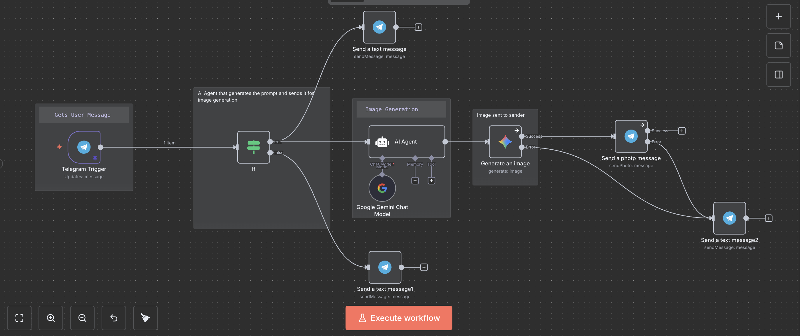

## 🎨 Prompt2Pic AI — Telegram Image Generation Bot

Generate cinematic AI images instantly through Telegram — no complex prompt-writing needed.    
[🧠 Try the Bot on Telegram](https://t.me/workflow9502_bot) *(May be temporarily unavailable)*

Prompt2Pic AI is an intelligent Telegram bot built using n8n workflows that removes the need for perfect prompt-writing.
It transforms simple user messages into refined, cinematic prompts using Google Gemini and generates high-quality images automatically — all through a single chat message.

Powered by Google Gemini (PaLM) APIs, it performs natural-language prompt refinement and image generation while maintaining a fully automated Telegram-based interface.

⸻

## 🚦 Current Status

The Gemini image generation API is currently unstable.
This may cause the live bot to respond with:

⚠️ “The service is currently under heavy load. Please try again in a moment.”

All internal workflows and automation logic remain fully functional — the limitation is entirely on the external API.

⸻

## 🎥 Full Demo Video

Even if the live bot is temporarily unavailable, you can still view the complete functionality here:

👉 Watch the full demo of Prompt2Pic AI in action
https://drive.google.com/drive/folders/1aAvdkg4ehFGKOxvMxOAc1OmR94np9dQt?usp=drive_link

This demo includes:

- The user → bot interaction  
- The full n8n workflow execution behind the scenes  
   
---

## 🚀 Overview  

Most AI tools demand users craft precise, descriptive prompts to get high-quality images — a barrier for many. Prompt2Pic AI bridges that gap, acting as a seamless connector between human imagination and AI creativity.
Users simply send a short message (like *“a robot drinking tea”*), and the bot:  

1. Refines it into a visually rich prompt using **Gemini LLM**, following cinematic realism rules.  
2. Passes that refined prompt to an **image generation model** (Gemini 2.0 Flash Image Generation).  
3. Sends the final **AI-generated image** and **refined prompts** back to the user via Telegram.  

---

## 🧠 Core Features  

- **Fully automated Telegram workflow** using n8n  
- **Prompt refinement** via Google Gemini language model  
- **AI image generation** using Gemini image API  
- **Smart user feedback** — sends refined prompt suggestions with every image  
- **Error handling & resilience** — gracefully manages request overloads or internal failures  
- **Zero-code deployment** — powered entirely by n8n visual logic  

---

## ⚙️ Architecture  
```
Telegram User  
   ↓  
n8n Workflow Trigger (Telegram node)  
   ↓  
AI Agent → Gemini Chat Model (Prompt Refinement)  
   ↓  
Gemini Image Generation (Model: gemini-2.0-flash-exp-image-generation)  
   ↓  
Telegram Message (Image + Refined Prompt Sent),
```
Each step is modular — allowing for easy updates, retries, or integrations.

---

## 🛠️ Tech Stack  

- **n8n** — workflow automation & orchestration  
- **Telegram Bot API** — message reception & image delivery  
- **Google Gemini API** — LLM-powered text refinement and image generation  
- **Render Cloud** — deployment and execution environment  

---

## 💡 Workflow Summary  

- **Trigger Node:** `Telegram Trigger` — listens for incoming user messages  
- **AI Agent Node:** Generates refined cinematic prompts  
- **Gemini Chat Model:** Refines prompt linguistically  
- **Image Generation Node:** Creates visual output based on refined prompt  
- **Response Node:** Sends image and structured prompts back to Telegram chat  
- **Error Node:** Sends fallback error message if any part of the flow fails  

---

## ⚠️ Error Handling  

Prompt2Pic AI includes complete runtime protection.  
If an issue occurs (due to API rate limits, model downtime, or internal node failure), the bot automatically replies:
> ⚠️ The service is currently under heavy load. Please try again in a moment.

This keeps the user experience smooth and avoids exposing backend details or crashes.
This ensures high reliability, even during external API downtime or rate limiting, maintaining user trust and continuity.

---

## 🧩 File Structure  
prompt2pic-ai/
│
├── workflow.json          # n8n exported workflow (safe, sanitized)
├── logo.png               # Bot logo or branding asset
├── README.md              # Documentation (this file)
└── workflow-preview.png  # Screenshot of workflow nodes in n8n

---

## 🧰 Setup & Deployment  

### 1. Import Workflow  
- Open n8n → click **Import from File**  
- Upload `workflow.json`  

### 2. Configure Credentials  
- Add your **Telegram Bot Token** in n8n Credentials  
- Add your **Google Gemini (PaLM) API key** in n8n Credentials  

### 3. Activate Workflow  
- Enable the **Telegram Trigger node**  
- Deploy the workflow — your bot goes live instantly  

> 🧱 Note: Ensure your Render/Server environment allows public webhook access.

---

## 🪄 Example Interaction  

**User:**  
> “a dragon flying over mountains”  

**Bot Response:**  
> *Here is your image! 🎨*  
> **Refined Prompt Options 🔥:**  
> 1. A photorealistic, ultra-high-quality cinematic shot of a dragon flying over rugged mountains, golden sunset lighting, dynamic mist trails.  
> *(+ AI-generated image attached)*  

---

## 🔍 Design Decisions  

- Error messages are **intentionally abstracted** to keep user trust.  
- The refined prompts are **educational**, helping users learn effective prompt-making.  
- The system uses **stateless message flow** — no persistent database, ensuring simplicity and speed.  
- Each workflow node includes **onError: continue**, allowing partial completion even during minor API failures.  

---

## 📈 Future Improvements  

- [ ] Add user-based request limits (e.g., 3–5 free prompts per day)  
- [ ] Integrate basic analytics (log prompts and timestamps)  
- [ ] Build a web dashboard for prompt history  
- [ ] Add multi-language support  
- [ ] Enable parallel image generation for batch requests  

---

## 👨‍💻 Author  

**Utkarsh Tiwari**  
> B.Tech CSE | Developer & Automation Enthusiast   
- 🌐 GitHub: [github.com/codemacUT](https://github.com/codemacUT)  

---

## 🖼️ Preview  




---

## 🪶 License  

This project is released under the **MIT License** — free to use, modify, and distribute with attribution.  

---

### 🌟 Inspiration  

Prompt2Pic AI embodies the blend of **AI automation, prompt engineering**, and **no-code workflow design** — showing how modern tools like n8n can deliver production-level experiences without traditional codebases.  
A simple idea, turned into a fully functional product.

